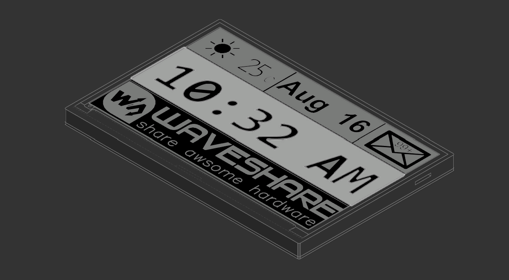
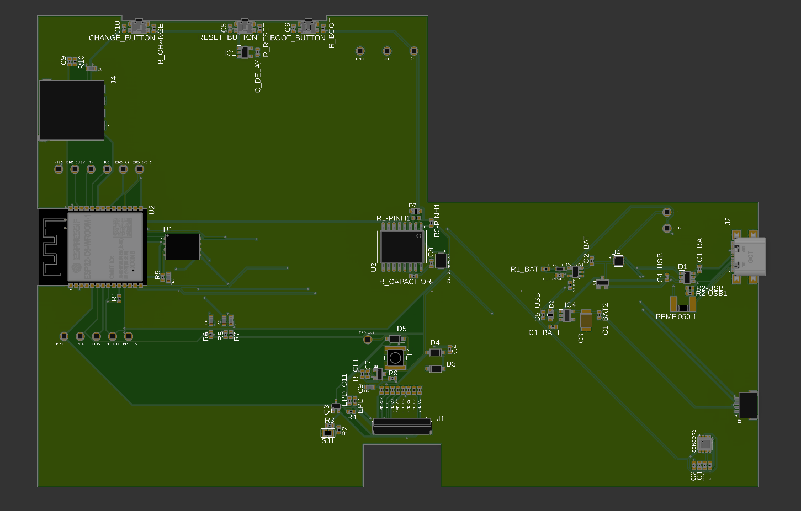
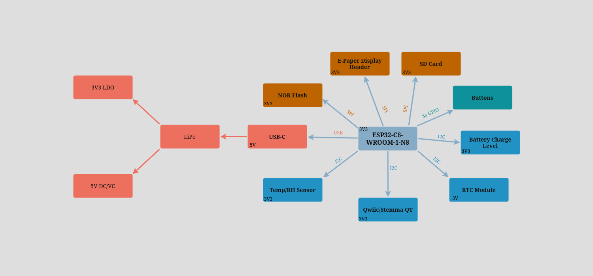

# E-book Reader

This is my implementation of an E-book Reader, made entirely in Autodesk Fusion.

## Device

## Exploded View

## PCB

## Block Diagram

## ESP32-C6 Pin Connections

### E-Paper Display
- MOSI --> GPIO4
- SCK --> GPIO5
- RESET --> GPIO15
- BUSY --> GPIO16
- CS --> GPIO17
- DC --> GPIO18

### SD Card
- CLK --> GPIO6
- CMD --> GPIO7
- DATA0 --> GPIO8
- DATA1 --> GPIO9
- DATA2 --> GPIO10
- DATA3 --> GPIO11

### NOR Flash Memory
- MOSI --> GPIO4
- MISO --> GPIO3
- CLK --> GPIO5
- CS --> GPIO2

### Temp/RH Sensor
- SDA --> GPIO19
- SCL --> GPIO20

### RTC Module
- SDA --> GPIO19
- SCL --> GPIO20

### Qwiic / Stemma QT
- SDA --> GPIO19
- SCL --> GPIO20

### Battery Charge Level
- SDA --> GPIO19
- SCL --> GPIO20

### Buttons
- Reset --> GPIO0
- Boot --> GPIO1

## Bill of Materials

| Component             | Datasheet                        |
|-----------------------|----------------------------------|
| ESP32-C6-WROOM-1-N8   | [Mouser](https://mou.sr/42swLfH) |
| FH34SRJ-24S-0.5SH     | [Mouser](https://mou.sr/43Cr53R) |
| XC6220A331MR-G        | [Mouser](https://mou.sr/4ieKgVa) |
| MAX17048G+T10         | [Mouser](https://mou.sr/3FWR5wY) |
| W25Q512JVEIQ          | [Mouser](https://mou.sr/42vsB6J) |
| USB4110-GF-A          | [Mouser](https://mou.sr/4iUMo5l) |
| USBLC6-2SC6Y          | [Mouser](https://mou.sr/42lyiTK) |
| DS3231SN#             | [Mouser](https://mou.sr/42jhNr4) |
| BME680                | [Mouser](https://mou.sr/42kgEzJ) |
| PFMF.050.2            | [Mouser](https://mou.sr/4cjORnD) |
| BD5229G-TR            | [Mouser](https://mou.sr/3EckiDF) |
| MBR0530-TP            | [Mouser](https://mou.sr/4i9Ddgn) |
| DMG2305UX-7           | [Mouser](https://mou.sr/4ci24gy) |
| PGB1010603MR          | [Mouser](https://mou.sr/3Yg9sDe) |
| Adafruit 4208         | [Mouser](https://mou.sr/4lcY19f) |
| SD0805S020S1R0        | [Mouser](https://mou.sr/4cljSYj) |
| SI1308EDL-T1-GE3      | [Mouser](https://mou.sr/4lj7JXH) |
| MCP73831-2ACI/MC      | [Mouser](https://mou.sr/3XJhnsM) |

## Hardware Description

### Main Controller

    ESP32-C6-WROOM-1-N8: RISC-V based microcontroller with WiFi 6 and Bluetooth 5.0 LE

    Operating Voltage: 3.3V

    Clock Speed: 160MHz

### Memory Configuration

    External NOR Flash: W25Q512JVEIQ (64MB capacity)

    Interface: SPI (Serial Peripheral Interface)

### Power Management System

    Primary Regulator: XC6220A331MR-G (3.3V LDO)

    Battery Charger: MCP73831 (Li-Po charging controller)

    Fuel Gauge: MAX17048G+T10 (Battery monitoring IC)

    Power Path Protection:

        MBR0530 Schottky diodes (x3)

        SI1308EDL-T1-GE3 MOSFET

### Display System

    E-Paper Display Interface: Dedicated header with ESD protection

    Display Driver Circuit: Custom EPD power management

    Control Signals:

        EPD_RST (Reset)

        EPD_BUSY (Status)

        EPD_DC (Data/Command)

        EPD_CS (Chip Select)

### Environmental Sensing

    BME688: Integrated environmental sensor with:

        Temperature

        Humidity

        Barometric pressure

        Air quality (VOC detection)

    Interface: I2C (Qwiic/Stemma QT compatible)

### Real-Time Clock

    DS3231SN: High-precision RTC with:

        ±2ppm accuracy

        Integrated temperature compensation

        Battery backup support

        Square wave/interrupt output

### Connectivity Interfaces USB

    Type-C Connector: USB 2.0 compliant

    ESD Protection: USBLC6-2SC6Y

    Data Lines:

        USB_D+

        USB_D-

### Expansion Ports

    Qwiic/Stemma QT: 4-pin I2C connector

    SD Card Slot: Supports standard SD cards

        Interface: SPI mode

        Detection switch included

### Debugging Interfaces

    Test Points: 17 accessible test points

### Power Specifications

    Input Voltage: 5V via USB-C

    Battery Voltage: 3.7V Li-Po

    Power Tree:

        Primary 3.3V rail for digital components

        Dedicated 3.3V rail for display

        RTC backup power circuit

### Mechanical Interfaces

    24-pin FH34SRJ Connector: Display interface

    Tactile Buttons:

        Reset button

        Boot/IO button

        Custom function buttons